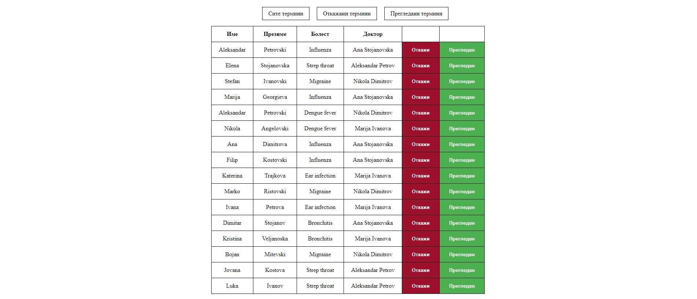

**Вежба 1:**
-	**Преглед на термини во болница**

**Преглед:** Во оваа вежба ќе работиме со податоци во JSON формат. 
Целта на оваа вежба е докторите во болницата да имаат преглед кон своите пациенти во текот на денот.

**Инструкции:**
-	Приказ на информациите за прегледите
-	Секој пациент има информации за своето име, презиме, години, болест, доктор кај кого се прегледува

**Насока:** Превземете податоци преку API линкот. 
На почеток од веб страната се наоѓаат три опции. 
-	Сите термини
-	Откажани термини
-	Прегледани термини

Со избор на еден од понудените опции докторите имаат преглед кон сите, откажаните, прегледаните термини во зависност од избраната опција.
На почеток термините треба да бидат прикажани во табела во **Сите термини** односно сите информации за пациентот и дополнителни две копчиња **Откажи**, **Прегледан**. 

Доколку докторот ја изберете опцијата **Откажи** информациите од тој клиент се додаваат во табелата за **Откажани термини** а истиот клиент во опцијата **Сите термин**и се додава различна боја на позадина и двете копчиња **Откажи** и **Прегледан** се исклучуваат.
Со одбирање на опцијата **Прегледан** информациите се додаваат во табелата Прегледани термини.

API линк: https://raw.githubusercontent.com/kitanovskiviktor/IPKS/main/IPKS%20-%20JSON/patients.json
 
