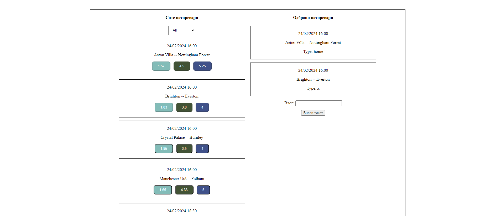

**Вежба 2:**
-	**Фудбалски тикет**

**Преглед:** Во оваа вежба ќе работиме со податоци во JSON формат.
Потребно е да се изгенерира фудбалско ливче кои потоа ќе се прикаже дали е добитно или не соодветно.
**Инструкции:**
-	Приказ на сите фудбалски натпревари
-	Секој фудбалски натпревар има дата, домаќин, гостин, време, коефициент за домаќинот, коефициент за гостинот, коефициент за нерешено.

**Насока:** Превземете ги податоците преку API чии линк ќе биде даден подолу. Доколку се соочите со проблем со вчитувањето или повикувањето на податоците преку API-то истите превземете ги преку дадениот json фајл во вежбата.
Прикажете ги сите фудбалски натпревари и нивните информации на веб страницата.
За секој натпревар треба да се прикаже неговиот датум, час, име на домаќинот, име на гостинот и нивните квоти во квадратчиња ( како копчиња ) посебно соодветно.
Над листата од сите натпревари се наоѓа листа со опаѓачки опции каде што корисникот може да селектира одредени натпревари според нивната фудбалска лига. 

**Опциите се**
-	Англиска
-	Германска
-	Шпанска
-	Француска
-	Италијанска

При кликнување на соодветна квота на натпреварот тој се додава во десната листа на Одбрани натпревари каде што му се додава уште еден property во вредност: **away, home, x** во зависност од корисникот која опција ја избрал. Кога ќе се додаде натпреварот треба квотите од левата листа да бидат исклучени за тој натпревар бидејќи е веќе додаден.
Најдоле од таа листа се наоѓа поле за внес на влогот ( цел број ) и копче **Внеси Тикет** каде што го проверува внесениот тикет од корисникот. 
Тикетот се проверува така што се проверува внесената опција од корисникот за секој натпревар со неговиот резултат. Резултатот се наоѓа во property-то **result** при превземањето на податоците од API-то. 

**Пример:** Избрана опција од корисникот за натпреварот X e типот “home” тоа значи дека корисникот прогнозира дека домаќинот ќе победи на натпреварот. Овој тип се проверува со резултатот **["result”: “4-2" ]** каде што клучот е резултатот изразен класично како на секој фудбалски натпревар. Треба да се споредат двете цифри доколку помеѓу себе а потоа со прогнозираниот тип од корисникот.

 

**Линк до API:** https://raw.githubusercontent.com/kitanovskiviktor/IPKS/main/IPKS%20-%20JSON/footballMatches.json

