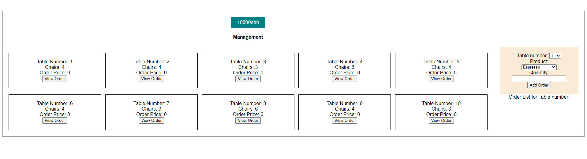

**Вежба 3:**
-	**Менаџирање на ресторан**

**Преглед:** Во оваа вежба ќе работиме со податоци во JSON формат.
Потребно е да се направи систем за управување со масите во ресторан.

**Инструкции:**
-	tables.json содржи податоци за масите во ресторанот односно редниот број, бројот на столици, цена, нарачка.
-	products.json содржи податоци за производите односно пијалоците што ги нуди ресторанот односно име, цена

**Насока:** Превземете ги податоците преку API или соодветниот фајл. Податоците за масите зачувајте ги локално во пребарувачот и истите прикажете ги на екран.
За секоја маса потребно е да се обезбедат следниве информации и функционалности
-	Број на маса
-	Број на столици
-	Цена на нарачка
-	Погледни нарачка – [ копче ]

Во десниот дел од екранот се наоѓа листа за внес на нарачка на соодветна маса.
Оваа листа се содржи од:
-	Поле за внес на реден број на маса
-	Поле за внес на пијалок
-	Поле за внес на количина на пијалокот
-	Додади нарачка – [ копче ]

**Функционалности:**
-	Погледни нарачка – со активирање на ова копче во десниот дел на екранот веднаш под листата за внес на нарачка, се додава целата нарачка за соодветната маса. Односно треба да се овозможи преглед кон пијалоците и количината што се нарачани на таа маса и копче Плати нарачка.
-	Плати нарачка – со активирање на ова копче нарачката се брише од соодветната маса и вкупната сума се додава во касата на ресторанот.
-	Додади нарачка – се додава нарачка за маса со избраниот реден број

На почеток од веб страницата се наоѓа каса на ресторанот со почетна вредност од 10.000денари која што е потребно да се ажурира со секоја платена нарачка.

 

API линк: https://raw.githubusercontent.com/kitanovskiviktor/IPKS/main/IPKS%20-%20JSON/tables.json
https://raw.githubusercontent.com/kitanovskiviktor/IPKS/main/IPKS%20-%20JSON/products.json

