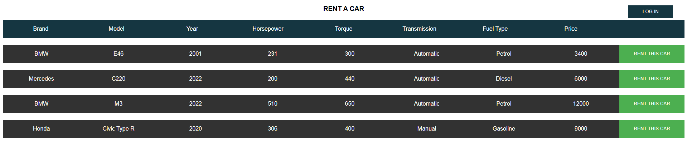
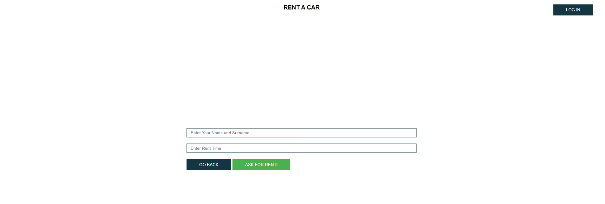
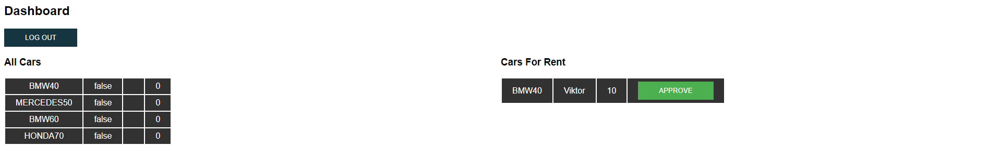

**Вежба 4:**
-	**Систем за управување за возила за изнајмување**

**Преглед:** Во оваа вежба ќе работиме со податоци во JSON формат. 
Потребно е да се направи систем за управување за возила за изнајмување со систем за логирање на сопственикот на компанијата.

**Инструкции:**
-	vehicles.json содржи информации за сите возила во возниот парк на компанијата
-	users.json содржи информации за системот на најава

**Насока:** Превземете ги соодветните податоци преку API линк или фајл и соодветно зачувајтe ги локално [ Local Storage ]. 
Веб страницата треба да има систем за најава односно форма за најава во панелот за администрација.
На почеток од веб страницата се излистани сите достапни возила за изнајмување со соодветна опција “Rent This Car”

**Функционалности:**
-	Rent This Car – со активирање на ова копче се отвора модален прозорец со две полиња за внес на информациите на клиентот и времетраење за изнајмување изразено во денови. Со две понудени опции “Go Back” и “Ask For Rent!”
-	Go Back – оваа опција треба да овозможи модалниот прозорец да се затвори и корисникот да се врати на почетната страна.
-	Ask For Rent – со активирање на оваа опција погоре наведените информации се испраќаат во панелот за администрација за одобрување. 
Информациите зачувајте ги во Local Storage во следен формат: [ owner, time, car, code ]
-	Log In – тековната содржина се прекрива и се отвора форма за внес на username и password на менаџерот. При успешно логирање се отвора панелот за администрација

**Панел за администрација содржи:**
-	Log Out – копче за одјава
-	All Cars – табела за приказ на сите возила што ги поседува компанијата со следниве информации 
[ code, isRented, owner, price ]
-	Cars For Rent – табела за приказ на возилата кои се побарани за изнајмување преку функционалноста Ask For Rent. Секое возило содржи информации за 
[ code, owner, time, approve]
-	Approve – при активација на оваа функционалност потребно е селектираното возило да се избрише од листата на возила побарани за изнајмување а листата на сите возила да се ажурира соодветно односно isRented, owner, price да добијат нови вредности
-	Price – се пресметува како price * time

 
 
 

API линк: https://raw.githubusercontent.com/kitanovskiviktor/IPKS/main/IPKS%20-%20JSON/vehicles.json
https://raw.githubusercontent.com/kitanovskiviktor/IPKS/main/IPKS%20-%20JSON/users.json

