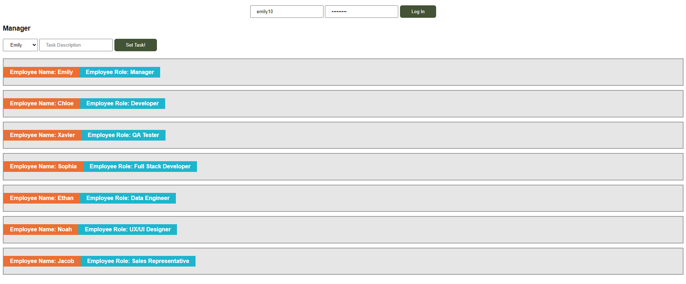
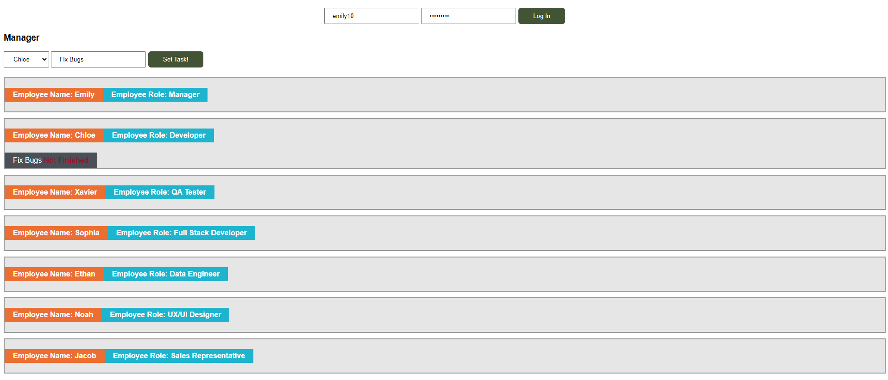

**Вежба 5:**
-	**Систем за управување на работни задачи за вработени**

**Преглед:** Во оваа вежба ќе работиме со податоци во JSON формат. 
Потребно е да се направи систем за управување на работните задачи за вработените кои им се зададени од менаџерот за тековниот ден.

**Инструкции:**
-	employeesTasks.json содржи информации за сите вработени

**Насока:** Превземете ги податоците соодветно од API линк или преку фајл и истите зачувајте ги во Local Storage.Секој вработен ги поседува следниве информации
-	име
-	презиме
-	позиција
-	корисничко име
-	лозинка
-	листа од задачи

На почеток од веб страницата се наоѓа форма за внес на username и password на вработениот.
Делот со работните задачи за вработениот и приказ на сите работни задачи на менаџерот се скриени тие се прикажуваат откако ќе се изврши најава соодветно.

**Менаџери:**
Приказ на сите вработени со нивните работни задачи, за секој вработен во својата работна задача потребно е да поседува и информација дали работната задача е завршена
-	Внес на нова работна задача – се избира вработен од опаѓачка листа, се внесува опис за работната задача. Со додавање на нова работна задача се ажурираат веќе излистаните информации за вработените каде што сега е додадена и новата работна задача за соодветниот вработен.

**Вработени:**
Приказ на работните задачи за тој вработен со опција **"Complete"**
-	Complete – со активирање на оваа опција статусот на работната задача треба да се ажурира од не завршена во завршена **[ Not Finished -> Completed ]**

 
 
 

**API линк:** https://raw.githubusercontent.com/kitanovskiviktor/IPKS/main/IPKS%20-%20JSON/employeeTasks.json

