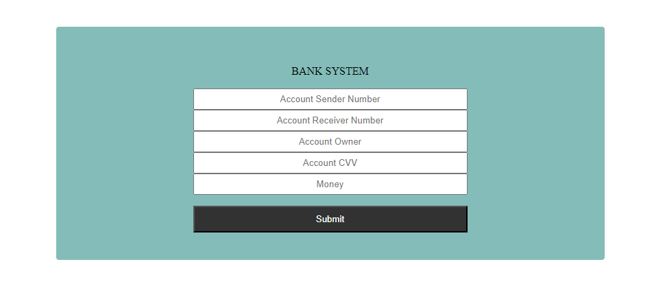
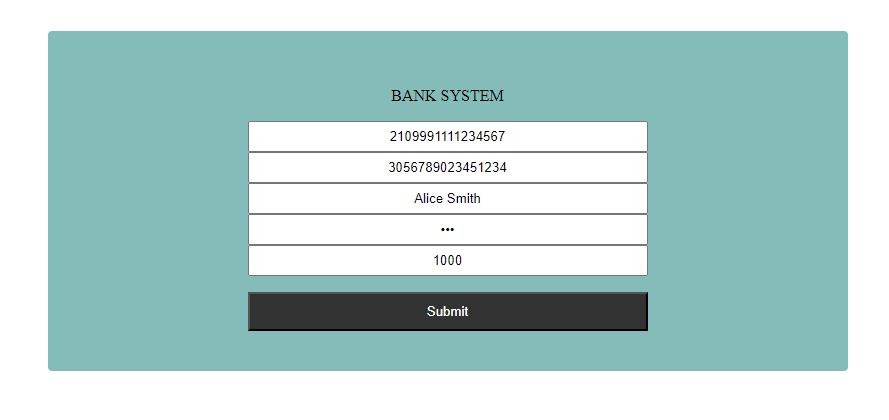

**Вежба 7:**
-	**Банкарски систем**

**Преглед:** Во оваа вежба ќе работиме со податоци во JSON формат. 
Да се направи симулација на банкарски систем со испраќање на пари од една сметка до друга.

**Инструкции:**
-	bankAccounts.json содржи информации за сите сметки во една банка

**Насока:** Превземете ги податоците соодветно од API линк даден подолу и истите зачувајте ги преку Local Storage во пребарувачот.

Секоја банкарска сметка поседува
-	број на сметка
-	сопственик
-	дата на истекување
-	салдо
-	CVV број

На веб страницата иницијално се прикажани пет полиња за внес на вредност и копче со функционалност "Submit".
Полињата за внес на вредност сочинуваат:
-	број на сметка на испраќач
-	број на сметка на примач
-	сопственик на сметка испраќач
-	CVV број на сметка испраќач
-	пари што се испраќаат

Потребно е да се направи симулација на испраќање на пари од една сметка кон друга така што при "Submit" се прават следните проверки
-	дали сите полиња се пополнети
-	доколку сметка испраќач и сметка примач се исти
-	дали вредноста на пари е помала од нула
-	дали двете сметки се точни

Доколку сите претходни услови се исполнети потребно е парите од сметка испраќач да се испратат кон сметка примач и новите ажурирани податоци да се зачуват локално во пребарувачот.

  

**API линк:** https://raw.githubusercontent.com/kitanovskiviktor/IPKS/main/IPKS%20-%20JSON/bankAccounts.json
