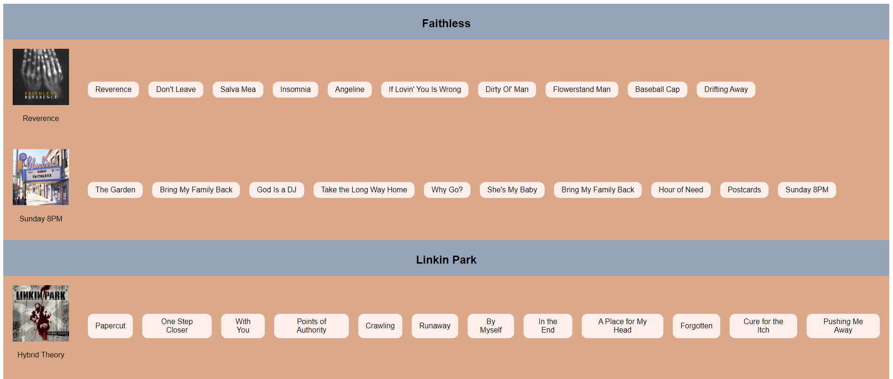

**Вежба 8:**
-	**Приказ на музички албуми со песни**

**Преглед:** Во оваа вежба ќе работиме со податоци во JSON формат. 
Потребно е да се прикажат музичките албуми и песни на артисти.

**Инструкции:**
-	albums.json содржи информации за сите артисти

**Насока:** Превземете ги податоците соодветно од API линк даден подолу. 

Секој артист ги поседува следниве информации
-	име
-	листа од албуми

Секој албум содржи податоци за:
-	името на албумот
-	слика
-	година на издавање
-	листа од песни

Потребно е да се прикажат сите податоци на екран, односно за секој артист неговите албуми и песни што се содржат во албумот.

 

**API линк:** https://raw.githubusercontent.com/kitanovskiviktor/IPKS/main/IPKS%20-%20JSON/albums.json
