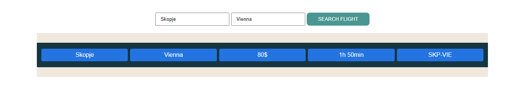

**Вежба 9:**
-	**Приказ на авионски лет**

**Преглед:** Во оваа вежба ќе работиме со податоци во JSON формат. 
Потребно е да се прикажат авионските летови од еден град до друг.

**Инструкции:**
-	destinations.json содржи информации за сите летови

**Насока:**  
Превземете ги податоците соодветно од API линк даден подолу. 
Податоците содржат информации за:
-	име на аеродром
-	код на аеродром
-	град каде се наоѓа
-	држава каде се наоѓа
-	листа од летови

Листата од летови содржи информации за:
-	рута на летот
-	дестинациски град
-	цена на летот
-	времетраење на летот

На почеток на веб страницата се наоѓаат две полиња за внес на вредност, овие вредности преставуваат почетен град и дестинациски град, и копче за пребарување на лет.
Пребарувањето на лет се извршува така што се проверува дали има соодветен лет од почетниот град до дестинацискиот град и истите се прикажуваат на екран, во спротивно се прикажува порака во вид на прозорец [ alert ] дека не е најден соодветен лет.

**API линк:** https://raw.githubusercontent.com/kitanovskiviktor/IPKS/main/IPKS%20-%20JSON/destinations.json
